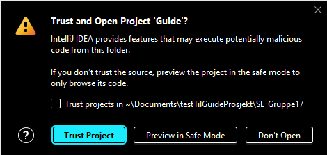

<h1 class="header">Guide</h1>

<ol>
<li>Last ned Prosjektet først <a href="https://github.com/ChrisBSuz/SE_Gruppe17/raw/main/Guide.zip">HER</a> og pakk ut</li>
<li>Åpne mappen "Guide" som er pakket ut i IntelliJ</li>
<li>Hvis systemet spør om å "stole" på prosjektet, trykk på "trust project" som vist på bildet under</li>
  
</img>
  
<li>Bruk JVM 21, hvis dette ikke er allerede installert så trykk på "change JDK" som vist i bildet under</li>  

</img>
   

<li>Deretter velg "openJDK 21" og last ned som vist i bildet nedenfor</li>
  

</img>
   

<li>Trykk på "automatisk" dersom systemet spør om tillatelse i brannmur</li>
  
</img>
  
<li>Trykk "last ned" når IntelliJ spør om "maven dependencies"</li>
<li>For å kjøre Tester så finnes det "run configuration" som heter "TestRunner"</li>
<li>For å kjøre Applikasjonen så finnes det "run configuration" som heter "Application"</li>
<li>Hvis du fortsatt har feil og "maven dependecies" ikke er lastet ned, så trykk på maven plugin til høyre inne på IntelliJ og trykk på "1" også "2" som vist i bildet under</li>
  
</img>
</ol>
